# Event storming – Spesped

Version 0.2 · 8 September 2026 · First modelling pass based on the requirements, not a workshop validated by school staff.

## Outcome and scope

Reduce the total work teachers and special educators spend collecting information, planning teaching, following up learners and preparing defensible documentation. Include public primary/lower-secondary schools and publicly funded private Montessori schools, grades 1–10. Parent emails cover an explicitly selected date range, with optional recurring draft preparation and no default weekly cadence. Their first release addresses eligible parents/guardians only. The first delivery slice prioritizes session preparation and actual teaching records; email drafting follows in P4. Statutory communication to learners remains a separate obligation.

The Norwegian legal and feature registries precede this model. The English terms below are internal domain language; users can continue working in Norwegian. The model is provisional where real schools use different language or authority arrangements.

We start with past-tense domain events, then identify actors, commands, policies, exceptions and boundaries. This follows the exploratory progression in [EventStorming's patterns](https://www.eventstorming.com/patterns/). The flows and decisions here are our proposed design, not prescriptions from that source.

## Notation

| Board element | Meaning | Example |
|---|---|---|
| Domain event | A meaningful fact that happened | `ObservationConfirmed` |
| Command | An actor requests a change; it may be refused | `ConfirmObservation` |
| Actor | A person with relevant authority | Assigned teacher |
| Policy | A reaction to an event under explicit conditions | When a reporting period closes, propose a draft |
| Read model | Information needed to decide or act | Evidence gaps for this learner and period |
| External system | An independent source or destination | School administration, PPT, archive, secure post |
| Hotspot | An unresolved question or risky assumption | Who may sign this document for this school? |

AI is a supporting system that proposes content. It is not a teacher, a guardian, a legal authority or a source of evidence about events in a child's life.

## Big-picture timeline

```mermaid
flowchart LR
  A[Information received] --> B[Evidence confirmed]
  B --> C[Teaching and support planned]
  C --> D[Session delivered]
  D --> E[Observation recorded]
  E --> C
  E --> F[Review period opened]
  F --> G[Document drafted]
  G --> H[Content reviewed]
  H --> I[Disclosure authorized]
  I --> J[Delivery requested]
  J --> K[Delivery outcome recorded]
  K --> L[Record disposition applied]
```

This timeline branches. An incoming concern may trigger urgent safeguarding without waiting for normal evidence confirmation. A source can be disputed. A learner may receive ordinary adapted teaching without an IEP. A school environment case is not an IEP. A report may need revision, and an uncertain delivery outcome requires reconciliation.

The first pilot combines ES02, the existing-plan intake subset of ES03–ES04, and a single-session path through ES05–ES06. It ends with a useful recorded observation for the next session. ES07 is a later communication flow. See the [Norwegian walkthrough for domain review](08-first-workflow-review.no.md).

## Flow ES01 – onboard a school and establish applicable rules

Features: F01, F02, F06, F27, F28, F31, F34. Legal areas: L001–L005, L045–L060, L064–L069, L087–L090.

| Actor / trigger | Command | Resulting event | Policy / exception | Read model |
|---|---|---|---|---|
| Authorized school administrator | `RegisterSchool` | `SchoolRegistered` | Record legal category and owner; do not infer from name | School configuration |
| Rule editor | `ProposeSchoolRuleProfile` | `RuleProfileProposed` | Attach curriculum and approval references | Applicable rules and unknowns |
| Authorized legal/policy reviewer | `ApproveRuleProfile` | `RuleProfileApproved` | Unresolved applicability stays unknown | Review differences and evidence |
| Administrator | `AssignStaffResponsibility` | `StaffResponsibilityAssigned` | Assignment is scoped, time-limited and competence-aware | Staffing and authority roster |
| Authorized clerk | `RecordGuardianRelationship` | `GuardianRelationshipRecorded` | Contact address alone does not establish disclosure rights | Recipient eligibility |
| Privacy/records owner | `ActivateProcessingConfiguration` | `ProcessingConfigurationActivated` | Real-data processing requires the approved configuration | Processing and retention register |

Policy: `RuleProfileApproved` evaluates applicability and creates `ObligationInstance`s. It does not assert that the school has fulfilled those obligations.

Hotspot H01: Public schools, private schools under the Private Schools Act and other private schools must never share a guessed legal profile.

## Flow ES02 – ingest notes, parent emails and documents

Features: F03–F05, F16, F27, F32, F33. Legal areas: L045–L058, L064.

| Actor / trigger | Command | Resulting event | Policy / exception | Read model |
|---|---|---|---|---|
| Teacher / authorized connector | `SubmitSourceItem` | `SourceItemReceived` | Deduplicate using scoped external identity and content digest | Intake queue |
| File intake service | `InspectSourceItem` | `SourceItemAccepted` or `SourceItemQuarantined` | Reject unsafe files; don't execute document instructions | Intake status |
| AI extraction service | `ProposeSourceInterpretation` | `SourceInterpretationProposed` | Include page/span, extraction uncertainty and possible learner matches | Source beside proposed fields |
| Authorized staff member | `ConfirmLearnerAssociation` | `LearnerAssociationConfirmed` | Ambiguous or multiple learners require explicit resolution | Candidate identities |
| Teacher | `ConfirmEvidence` | `EvidenceConfirmed` | Preserve attribution: “parent reported” differs from “teacher observed” | Evidence and provenance |
| Teacher | `DisputeEvidence` | `EvidenceDisputed` | Retain relevant competing accounts; do not silently overwrite | Disputed items |
| Authorized records user | `CorrectEvidenceAssociation` | `EvidenceAssociationCorrected` | Revoke erroneous derived access and mark affected outputs stale | Impact list |

Policy: confirmation updates an authorized learner timeline and proposes follow-up tasks. It does not automatically certify a diagnosis, change a decision, or distribute source emails.

Hotspots H02–H04: one email can mention several children; forwarded email may contain unnecessary family information; urgent concerns cannot wait for AI or ordinary intake review.

## Flow ES03 – identify support needs and record a decision

Features: F07, F11, F22, F38. Legal areas: L006–L014, L041, L062–L063.

| Actor / trigger | Command | Resulting event | Policy / exception | Read model |
|---|---|---|---|---|
| Teacher | `RaiseLearningConcern` | `LearningConcernRaised` | Assign a real follow-up owner | Learning evidence and current measures |
| Responsible educator | `PlanAdaptation` | `AdaptationPlanned` | Ordinary teaching support may start without an IEP | Previous adaptations |
| Educator | `ReviewAdaptationOutcome` | `AdaptationOutcomeReviewed` | Consider sufficient evidence and changed circumstances | Observations/results |
| Authorized staff | `PrepareReferral` | `ReferralPrepared` | Identify required consent and proper authority | Referral completeness |
| Learner/representative action recorded by staff | `RecordReferralConsent` | `ReferralConsentRecorded` | Verify subject, scope and representation | Consent/authority history |
| Authorized sender | `SubmitReferral` | `ReferralSubmitted` | Track actual external transmission separately | Dispatch evidence |
| PPT document received | `RecordExpertAssessment` | `ExpertAssessmentRecorded` | Recognize source authority; AI summary remains derivative | Expert assessment and recommendations |
| Competent authority's decision received | `RecordEducationDecision` | `EducationDecisionRecorded` | Check identity, authority, effective period, scope and completeness | Decision clauses and obligations |

The system may prepare decision drafts for properly authorized caseworkers. An imported `EducationDecisionRecorded` means a decision was recorded, not that our application issued it. An incomplete/expired decision creates a review task; it never silently authorizes reducing support.

Hotspots H05–H06: the home municipality decides ITO for a publicly funded private-school learner; consent to ITO, permission to share records, and GDPR processing grounds are distinct concepts.

## Flow ES04 – develop and revise an individual education plan

Features: F08, F09, F17, F39. Legal areas: L015–L019, L021.

| Actor / trigger | Command | Resulting event | Policy / exception | Read model |
|---|---|---|---|---|
| Authorized educator | `RegisterExistingPlan` | `ExistingPlanRegistered` | Preserve original approval/source; confirm identity, effective goals and decision references without generating a new IEP | Existing plan basis for P2 |
| Responsible special educator | `RequestPlanDraft` | `PlanDraftRequested` | Retrieve active decision and authorized evidence | Decision, curriculum and learner strengths |
| Drafting service | `ProposePlanRevision` | `PlanRevisionProposed` | Each proposed goal and adaptation has an explicit basis | Draft with source links |
| Teacher / learner / parent input recorded | `RecordPlanContribution` | `PlanContributionRecorded` | Distinguish participation from formal approval | Contributions and unresolved differences |
| Special educator | `SubmitPlanForReview` | `PlanReviewRequested` | Required fields and decision constraints checked deterministically | Missing fields and conflicts |
| Authorized educator | `ApprovePlanRevision` | `PlanRevisionApproved` | Pin decision/rule/evidence versions and academic responsibility | Exact revision |
| Responsible educator | `ActivatePlanRevision` | `PlanRevisionActivated` | Only activate within relevant authority and effective dates | Active plan and previous versions |
| New decision / changed need | `ProposePlanChange` | `PlanChangeProposed` | Out-of-scope changes lead back to responsible authority | Impact analysis |

Hotspot H07: a new plan version must not rewrite the historical goals against which earlier teaching and annual evaluation are assessed.

## Flow ES05 – prepare a week, a teaching session and an assistant brief

Features: F09, F10, F12–F14, F36, F39. Legal areas: L004–L005, L009–L015, L018, L069–L073, L082.

1. A class teacher publishes a plan: `ClassPlanPublished`.
2. A special educator requests proposals: `SessionProposalsRequested`.
3. The service proposes goals, resources and adaptations: `SessionPlanProposed`.
4. The educator approves the concrete session plan: `SessionPlanApproved`.
5. The educator confirms pedagogically acceptable grouping: `GroupSuitabilityConfirmed`.
6. The scheduler calculates a candidate: `ScheduleProposalCreated` or `ScheduleConflictDetected`.
7. A timetable planner reviews changes and locked slots: `SchedulePublished`.
8. The responsible teacher approves an assistant brief: `AssistantBriefApproved`.
9. The assigned assistant opens the brief: `AssistantBriefAccessed`.

In P2, an educator manually chooses one session slot and confirms its participants, resources and responsibilities. The automated grouping/scheduling steps arrive in P5. Session approval and brief approval are required in both paths.

Scheduling policy uses checked constraints: staff availability and competence, support decision, minutes, overlapping learners, location, materials, protected class activities, preparation and guidance time. Preferences such as a preferred time of day are separate. No available schedule can change a learner's entitlement.

An assistant opening a brief is not proof of understanding, necessary training or completed teaching. A changed plan invalidates its dependent brief when pedagogically relevant. Long Montessori work periods and movable presentations are supported alongside fixed lesson slots.

Hotspot H08: group suitability is a pedagogical judgement. A resource optimizer can check overlap and capacity; it cannot establish that a grouping is in a child's best interests.

## Flow ES06 – record actual teaching and evaluate progress

Features: F11, F15–F17, F19, F23, F39. Legal areas: L017–L018, L020–L022, L030, L033.

| Actor / trigger | Command | Resulting event | Policy / exception | Read model |
|---|---|---|---|---|
| Teacher/assistant within assignment | `RecordSessionDelivery` | `SessionDeliveryRecorded` | Per-learner participation, actual minutes and support category | Scheduled versus delivered |
| Teacher | `RecordSessionCancellation` | `SessionCancelled` | Record reason and responsible follow-up | Coverage gaps |
| Staff member | `RecordObservation` | `ObservationRecorded` | Separate observed event from interpretation and date of entry | Quick note |
| Qualified assessor | `RecordAssessmentResult` | `AssessmentResultRecorded` | Instrument/version/conditions and valid scale required | Assessment history |
| Responsible educator | `ReviewGoalProgress` | `GoalProgressReviewed` | Mark limited evidence; scores from different tools are not interchangeable | Goal-linked evidence |
| Teacher | `SelectNextTeachingStep` | `NextTeachingStepSelected` | AI suggestion may be rejected without changing underlying evidence | Proposed adaptations |

Policy: actual delivery updates the entitlement ledger through explicit classification, never by copying schedule entries. A group session may give each participating learner their actual minutes while counting the staff allocation once. Counting rules must follow each decision; some group participation may not satisfy a particular entitlement.

Hotspots H09–H10: student absence, provider cancellation and missing staffing are different facts; changes in test conditions can make apparent score changes misleading.

## Flow ES07 – prepare a parent email for a selected period

Features: F20, F21, F27, F33; shares document infrastructure with F18. Legal areas: L002, L045–L060. The selected period and optional draft recurrence are product choices. This flow is introduced at P4 and is not the first pilot's completion condition.

| Actor / trigger | Command | Resulting event | Policy / exception | Read model |
|---|---|---|---|---|
| Teacher / special educator | `RequestParentEmailDraft` | `ParentEmailDraftRequested` | One learner, explicit date range, purpose and evidence cutoff; preview resolved dates | Period evidence, gaps and prior communication coverage |
| Teacher choosing optional recurrence | `ConfigureEmailDraftSchedule` | `EmailDraftScheduleConfigured` | Frequency, period rule, owner, timezone, next run and end date are separate fields | Schedule preview |
| Responsible teacher | `ActivateEmailDraftSchedule` | `EmailDraftScheduleActivated` | Manual on-demand use remains available; activation grants no future dispatch approval | Active schedules |
| Active schedule becomes due | `GenerateScheduledParentEmailDraft` | `ParentEmailDraftRequested` or `DraftGenerationSkipped` | Deduplicate by schedule revision, learner and period; pause if owner/access is invalid | New draft or actionable skip reason |
| Responsible teacher | `PauseEmailDraftSchedule` / `EndEmailDraftSchedule` | `EmailDraftSchedulePaused` / `EmailDraftScheduleEnded` | Pending drafts remain identifiable; queued jobs recheck schedule state | Schedule history |
| Drafting service | `ProposeDocumentRevision` | `DocumentRevisionProposed` | Subject and body; facts supported internally; planned next steps labelled separately | Draft beside sources |
| Assigned teacher/special educator | `ReviewDocumentRevision` | `DocumentReviewCompleted` or `RevisionRequested` | Edit and inspect evidence; insufficient material can lead to cancellation or manual drafting | Gaps and changes |
| Authorized educator | `ApproveDocumentContent` | `DocumentContentApproved` | Approval binds to exact subject, body, attachments and language revision | Final content |
| Authorized sender | `AuthorizeDisclosure` | `DisclosureAuthorized` | Check each guardian's entitlement, purpose, content and approved channel | Recipient-specific preview |
| Authorized sender | `RequestDispatch` | `DispatchRequested` | Re-check access and approvals; explicit action and idempotency key required | Dispatch confirmation |
| Delivery connector | `RecordDeliveryOutcome` | `DeliveryAccepted`, `DeliveryFailed` or `DeliveryOutcomeUnknown` | Reconcile unknown outcome before retry | Delivery history |
| Confirmed provider receipt / portal access | `RecordReceipt` | `DeliveryReceiptRecorded` | Transport acceptance and actual access are distinct | Receipt evidence |

Period policy: the two UI dates are inclusive in the school's timezone. Select evidence by occurrence date, and freeze the known source versions at `EvidenceCutoff`. Older background is explicitly marked as context; future activity is a plan. A late-entered observation within the period raises a revision need instead of silently modifying approved/sent content. Changing the period creates a new unapproved revision.

Shortcuts such as “last 14 days”, “previous month” and “since last sent period” always resolve to visible dates. “Since last” requires a selected recipient and purpose and uses a confirmed sent package's period for that combination, not an abandoned draft, failed transmission or uncertain outcome. Without such a baseline, the teacher chooses dates. Reject a start date after the end date. Overlap is allowed with an explicit warning. If a job misses several periods, ask the responsible user to choose catch-up periods instead of automatically producing a backlog of messages.

Initial recipient policy: the `ParentEmail` document type allows eligible guardians. A later learner-facing type has its own audience rules. Statutory learner communication remains separately available. A safe ordinary email may carry approved content; protected content uses the school's permitted secure channel or a minimal notification. Exporting/copying a draft to an external client is recorded as prepared/exported, not as verified sent.

Any edit to approved text, attachments or language variant requires the relevant new content approval. Changing recipient/purpose/channel requires new disclosure authorization. Revoked guardian access before dispatch blocks release. A portal may revoke future access but cannot erase copies already downloaded.

Hotspots H11–H12 and H16: guardian entitlement, exact-package approval, useful periods and optional recurrence must be validated with the school. No schedule authorizes automatic sending.

## Flow ES08 – annual ITO evaluation and other formal assessment

Features: F06, F08, F15, F17–F19, F21, F38. Legal areas: L017, L020–L032.

1. `ReportingObligationBecameDue` opens the review period and identifies an accountable role.
2. `EvidenceSnapshotCreated` pins learner, period, goals and plan revisions, delivery records and assessment evidence.
3. `EvidenceGapDetected` requests a targeted clarification where necessary. Missing evidence is not filled with invented progress.
4. `AnnualEvaluationDraftProposed` describes delivered teaching and development against the relevant goals.
5. `TeacherContributionSubmitted` collects appropriate subject input; a lead reviewer reconciles conflicts.
6. `DocumentContentApproved` records responsibility for the actual document revision.
7. `DisclosureAuthorized` and `DispatchRequested` use the ES07 dispatch path with this document type's recipients.
8. `ObligationEvidenceLinked` records which output/action supports which obligation. A reviewer may still mark the obligation incomplete.
9. `AnnualEvaluationReviewed` can propose teaching or referral changes; it does not automatically change the decision or IEP.

For half-year assessment, the scheme may require an oral assessment, a written grade or Montessori-specific outputs. `AssessmentCommunicated` records that the assessment was actually provided; drafting it is not that event. `GradeFinalized` is a command outcome for a qualified teacher, not an AI calculation.

Hotspot H13: a common document engine is useful, but each document type requires separate purpose, audience, required elements and review authority.

## Flow ES09 – school environment, physical incidents and safeguarding

Features: F24–F26, F21, F22, F29. Legal areas: L034–L040, L047–L048, L079.

| Trigger / actor | Command | Event | Policy and essential exception |
|---|---|---|---|
| Any staff concern | `RecordSafeguardingConcern` | `SafeguardingConcernRecorded` | Acknowledge responsible handling; software availability is not a condition for acting |
| Responsible staff member | `RecordConcernNotification` | `ConcernNotificationRecorded` | Record who actually received it; route around a leader implicated in the case |
| School investigates | `RecordInvestigationActivity` | `InvestigationActivityRecorded` | Preserve learner voice and relevant evidence in a restricted case |
| Responsible school leader | `ApproveEnvironmentActionPlan` | `EnvironmentActionPlanApproved` | Include problem, actions, owners and evaluation timing |
| Assigned actor | `RecordActionPerformed` | `EnvironmentActionPerformed` | Approved action and performed action are separate facts |
| Responsible educator/leader | `EvaluateActionPlan` | `EnvironmentActionPlanEvaluated` | Continue or change actions when necessary |
| Staff used a physical intervention | `RecordPhysicalIntervention` | `PhysicalInterventionRecorded` | Dedicated required information and notification path |
| Staff assesses personal reporting duty | `SubmitConcernReport` | `ConcernReportSubmitted` | No required headteacher approval; human sender determines content and legal basis |
| Immediate risk | `RecordEmergencyAction` | `EmergencyActionRecorded` | Real-world emergency action comes first; log afterwards if necessary |

The normal report approval workflow is not a universal gate for personal or urgent legal duties. The authorized responsible person can submit the relevant concern. The product provides contact routes and documentation, not automated determinations of abuse or instructions for physical restraint. Notifications to guardians in a safeguarding matter require case-specific consideration; a generic “copy parents” policy is prohibited.

## Flow ES10 – attendance, meetings and coordinated support

Features: F22, F23, F35, F38. Legal areas: L025–L026, L033, L040–L043.

`AbsenceRecorded` → `AttendanceFollowUpAssigned` → `FamilyContactRecorded` → `FollowUpMeetingScheduled` → `LearnerContributionRecorded` → `MeetingDecisionsConfirmed` → `SupportActionAssigned` → `SupportActionCompleted` → `AttendanceFollowUpReviewed`.

The read model combines authorized attendance and teaching context. It does not expose all safeguarding or health material. A meeting can address multiple tasks; linking it to several obligations avoids duplicate minutes. A cancelled meeting reopens the task. A welfare `IndividualSupportPlan` is a referenced coordinated plan, not an alias for an `IndividualEducationPlan`.

## Flow ES11 – rights requests, corrections and transfers

Features: F05, F21, F27, F28, F35. Legal areas: L048–L052, L061, L064–L065.

| Command | Event | Consequence |
|---|---|---|
| `RegisterRightsRequest` | `RightsRequestRegistered` | Verify identity/representation and create the correct deadline |
| `PrepareDisclosureBundle` | `DisclosureBundlePrepared` | Include relevant data and metadata, with third-party review |
| `DecideRightsRequest` | `RightsRequestDecided` | Authorized human decides scope, exceptions and response |
| `CorrectConfirmedEvidence` | `EvidenceCorrectionConfirmed` | Mark affected drafts stale; assess already-sent documents separately |
| `IssueDocumentCorrection` | `DocumentCorrectionIssued` | Create a new version; retain authorized history and delivery record |
| `OpenSchoolTransfer` | `SchoolTransferOpened` | Distinguish transfer purpose and relevant legal grounds |
| `ApproveTransferPackage` | `TransferPackageApproved` | Select necessary information; never send the whole dossier by default |
| `ApplyRecordDisposition` | `RecordRetained`, `RecordArchived` or `RecordErased` | Apply approved category policy, legal holds and verified archive receipt |

A factual correction does not erase a lawful historical decision. A retention duty does not authorize unrelated operational use of every old note. Deleting operational evidence also invalidates search chunks, caches and AI-derived summaries subject to that disposition; legally retained material remains in an appropriately restricted records store.

## Flow ES12 – governance, integrations and reliable operation

Features: F06, F29–F34, F37, F40. Legal areas: L053–L059, L064–L090.

- `RuleSourceChangeDetected` → `RuleChangeReviewRequested` → `RuleVersionApproved` → `AffectedObligationsReevaluated`. This is a future product capability; this research task does not install a recurring monitor.
- `ComplianceDeviationRecorded` → `RemedialActionAssigned` → `RemedialActionEvidenceSubmitted` → `DeviationReviewed`.
- `StatutoryExportPrepared` → `ExportReconciled` → `ExportAttested` → `ExternalSubmissionRecorded`.
- `IntegrationConnectionAuthorized` → `ImportBatchReceived` → `ImportConflictDetected` or `ImportBatchReconciled`.
- `PersonalDataBreachDetected` → `BreachAssessmentRecorded` → `RequiredNotificationSubmitted` → `RemediationVerified`.
- `ModelVersionProposed` → `ModelEvaluationCompleted` → `ModelVersionReleased`. Failed evaluation blocks promotion.
- `InferenceUnavailable` → `ManualWorkflowOffered`; no implicit switch from local production processing to an external model.
- `BackupRestoreExerciseCompleted` records evidence of recovery, not merely a backup job completing.
- `WorkloadStudyCompleted` informs product improvement using agreed, privacy-conscious measures.

## Cross-flow policies

| ID | Policy | Relevant flows |
|---|---|---|
| POL01 | A source can propose a fact; confirmation preserves attribution and provenance | ES02, ES03, ES06 |
| POL02 | Plan scope cannot exceed the referenced decision without a new authority process | ES03, ES04 |
| POL03 | Scheduling and delivery are separate; only classified actual delivery updates coverage | ES05, ES06 |
| POL04 | Report facts use an explicit evidence snapshot; gaps remain visible | ES07, ES08 |
| POL05 | Approval binds to revision, package and appropriate authority | ES07, ES08, ES11 |
| POL06 | Current recipient rights are rechecked at dispatch, including after queued delays | ES07, ES11 |
| POL07 | Normal approval rules cannot prevent a personal or urgent reporting duty | ES09 |
| POL08 | Tenant, learner and case authorization apply before retrieval, generation and export | All |
| POL09 | Rule status is applicable / not applicable / unresolved, with a reason and effective date | ES01, ES12 |
| POL10 | Changing evidence or rules identifies affected outputs; final records require an explicit correction process | ES02, ES04, ES08, ES11, ES12 |
| POL11 | External retry must not produce duplicate submissions; uncertain outcomes are reconciled | ES07, ES11, ES12 |
| POL12 | Any cross-school reuse must be permitted for that content; student-specific evidence is never pooled as teaching material | ES02, ES05, ES12 |
| POL13 | Summary period, evidence cutoff, draft recurrence and dispatch authorization are separate concepts | ES07, ES08 |

## Hotspots to validate with practitioners

| Hotspot | Proposed default | Validation owner |
|---|---|---|
| H01 Legal school category | Explicit school profile with approval evidence | School owner / legal reviewer |
| H02 Multiple learners in one source | Restricted original and separately authorized learner-specific extracts | Teachers / privacy owner |
| H03 Conflicting parent/staff accounts | Preserve attribution and record disagreement | Teachers / special educator |
| H04 Urgent incoming concern | Direct manual escalation available immediately | School leader / safeguarding owner |
| H05 Decision authority | Verify authority independently of application role | Municipality / school owner |
| H06 Different consent concepts | Separate records and scopes | Legal/privacy reviewer |
| H07 Historical goal revisions | Evidence links to effective plan revision | Special educator |
| H08 Group suitability | Educator confirms; solver checks logistics | Special educator / teacher |
| H09 Entitlement counting | Per-learner actual delivery plus separate staff allocation | School leader / municipality |
| H10 Assessment comparability | Instrument/version/conditions and professional review | Assessment lead |
| H11 Guardian disclosure | Per-person, per-purpose eligibility with restrictions | Privacy owner / school |
| H12 Batch approval | Only inspected, frozen individual packages; no open-ended auto-send | Teachers / school leader |
| H13 Document authority | Rule-driven reviewer roles; one or more depending on type | School owner |
| H14 Records authority | Identify the authoritative system for each record class | Archive/records owner |
| H15 Production inference | Entire approved AI processing chain local; capacity benchmark required | Technical owner |
| H16 Email period and recurrence | Explicit dates; on-demand default; opt-in drafts only; visible overlap and late evidence | Teachers / special educator |

The next workshop should use three anonymized scenarios: a normal teaching week, a changed ITO decision mid-year and a difficult guardian/school-transfer case. Ask participants to correct the events and authority boundaries before freezing class names. No external stakeholders have yet validated this model.
