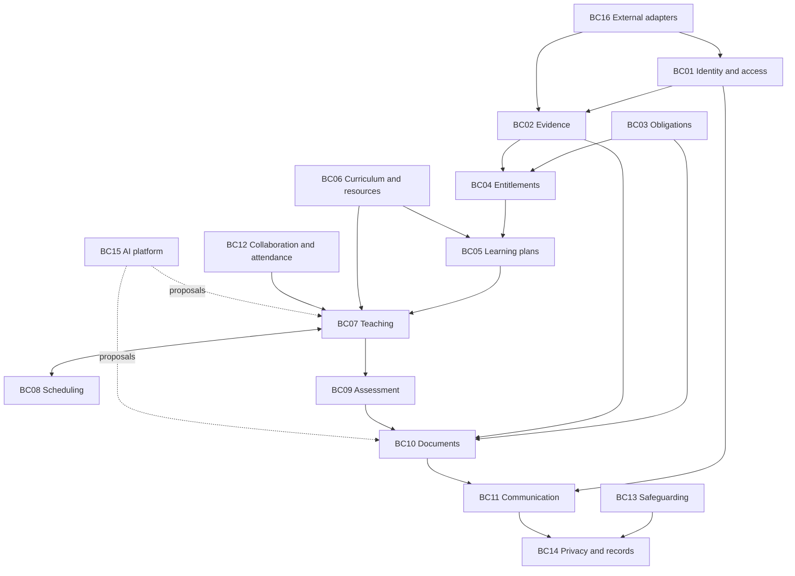
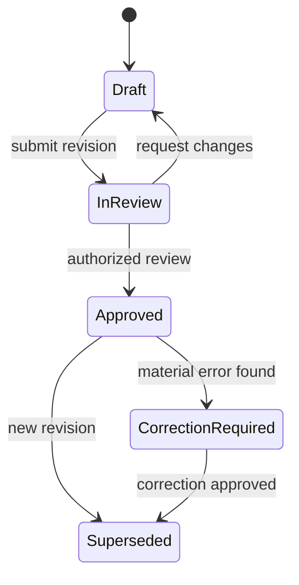

# Domain model – Spesped

Version 0.1 · 7 September 2026. Derived from [event storming](03-event-storming.en.md), with unresolved hotspots retained. This is a proposed model, not a database schema or validated implementation.

Use a shared vocabulary inside each bounded context, keep transaction boundaries small, and reference other aggregates by identity. These principles follow [Eric Evans' DDD reference](https://www.domainlanguage.com/wp-content/uploads/2016/05/DDD_Reference_2015-03.pdf); the contexts, classes and invariants below are specific design proposals for this product.

## Ubiquitous language

| English domain term | Norwegian user term | Meaning / distinction |
|---|---|---|
| `Learner` | Elev | A person enrolled at a school; not a container for every record |
| `GuardianRelationship` | Foreldre-/foresattrelasjon | A sourced, effective-dated relationship; not automatically a disclosure grant |
| `LearningEvidence` | Læringsgrunnlag / observasjon | Attributed evidence that can support a teaching or assessment claim |
| `SourceItem` | Kildedokument / innkommet opplysning | Original email, note, attachment or imported document |
| `ExpertAssessment` | Sakkyndig vurdering | Assessment by the competent expert service; distinct from an ordinary test result |
| `EducationDecision` | Enkeltvedtak om opplæring/tilrettelegging | An authority's formal decision, with typed provisions |
| `IndividuallyAdaptedEducation` | Individuelt tilrettelagt opplæring, ITO | A particular support entitlement; not a synonym for all adaptations |
| `IndividualEducationPlan` / `IEP` | Individuell opplæringsplan, IOP | A pedagogical plan within the decision's scope |
| `IndividualSupportPlan` | Individuell plan, IP | A coordinated welfare plan; separate from IEP/IOP |
| `LearningGoal` | Mål/delmål | Intended learning tied to a plan revision and evaluation approach |
| `TeachingSessionPlan` | Undervisningsopplegg for økt | Intended teaching, not evidence it happened |
| `SessionDelivery` | Gjennomført økt | Actual activity, learner participation and staff involvement |
| `AssistantBrief` | Assistentkort | An approved practical guide; not independent teaching authority |
| `AssessmentResult` | Kartleggingsresultat | A result from an identified instrument and conditions |
| `ProgressReview` | Vurdering av utvikling | An educator's interpretation of relevant evidence |
| `AssessmentStatement` | Underveis-/halvårsvurdering | A formal or formative assessment under the applicable scheme |
| `AnnualSupportEvaluation` | Årlig ITO-evaluering | A report type, not a generic annual report for every pupil |
| `WeeklyParentUpdate` | Ukesoppdatering til foresatte | A voluntary communication type with initial guardian-only routing |
| `ContentApproval` | Faglig godkjenning | Approval of an exact document revision |
| `DisclosureAuthorization` | Godkjenning av utlevering | Permission for a particular recipient/package/purpose/channel |
| `Dispatch` | Utsending | An external transmission attempt with reconciled outcome |
| `ObligationInstance` | Konkret oppfølgingsplikt | A requirement applied to one school/learner/case/period |
| `EnvironmentActionPlan` | Tiltaksplan i skolemiljøsak | Dedicated plan for school environment duties |

Avoid a generic `Assessment` class covering PPT, tests, progress and grades. Avoid a generic `Consent` boolean, generic `ReportApproved` flag or global `StudentStatus` score.

## Strategic design and bounded contexts

These are module boundaries in an initial modular monolith. A context is not a requirement for a separate deployable service.

| Context | Name / classification | Owns | Main feature IDs |
|---|---|---|---|
| BC01 | School Identity & Access – supporting | Schools, enrollment, guardian relations, staff assignments and authority grants | F01, F02, F31 |
| BC02 | Evidence Intake – core | Sources, extraction proposals, confirmed attributed evidence and corrections | F03–F05 |
| BC03 | Obligations & Governance – core/supporting | Rule versions, applicability, deadlines, deviations, management exports and workload studies | F06, F29, F30, F37, F40 |
| BC04 | Support Entitlements – core | Referrals, expert assessments, formal decisions, consent records, exemptions and appeals | F07, F38 |
| BC05 | Individual Learning Plans – core | Learning profile, IEP revisions, goals and plan contributions | F08 |
| BC06 | Curriculum & Resources – supporting | Approved curriculum schemes, class plans, teaching resources and material catalog | F09, F10 |
| BC07 | Teaching Practice – core | Session plans, assistant briefs, actual delivery, observations and selected next steps | F12, F13, F15, F16, F39 |
| BC08 | Resource Scheduling – core | Availability, requirements, pedagogically accepted groups and schedule proposals | F14, F36 |
| BC09 | Assessment & Progress – core | Instruments/results, progress reviews and assessment statements | F11, F17, F19 |
| BC10 | Document Preparation & Review – core | Evidence snapshots, document revisions, contributions and content approval | F18, F20 |
| BC11 | Family Communication – core/supporting | Recipient packages, disclosure authorization, portal grants and dispatch state | F21 |
| BC12 | Collaboration & Attendance – supporting | Meetings, follow-up tasks, attendance episodes and coordinated support | F22, F23 |
| BC13 | Safeguarding – distinct protected context | Environment cases, physical interventions and concern-report workflows | F24–F26 |
| BC14 | Privacy & Records – supporting | Rights requests, retention, legal holds, archive receipts and transfer packages | F27, F28, F35 |
| BC15 | AI & Operational Platform – generic/supporting | Model policies, generation jobs, evaluations, processing boundaries and recovery | F33, F34 |
| BC16 | Integrations – generic/supporting | External identities, import batches, reconciliation and connector capabilities | F32 |

F02's user-facing profile is a composition: identity comes from BC01, a curated learning profile from BC05, and permitted evidence summaries from BC02/BC09. F31 accessibility is implemented across every UI, not confined to BC01. A “primary feature owner” is not permission for other contexts to read its tables directly.

## Context map

Arrows represent published contracts, not unrestricted access. The diagram omits cross-cutting authorization/records contracts for readability. Safeguarding exports are explicit purpose-limited packages; general teaching/reporting cannot query its case store by default.

Relationship choices:

- School administration and identity providers are external upstream systems. BC16 translates their concepts through anti-corruption layers; their identifiers are not exposed as internal authority rules.
- BC04 publishes decision references and typed entitlement summaries to BC05/BC08. Those contexts cannot modify the decision.
- BC10 is downstream of evidence, plans, delivery and assessments. It requests authorized snapshots rather than querying all source tables.
- BC11 accepts a frozen document revision plus a purpose. It does not infer a lawful recipient from a previous email thread.
- BC03 publishes approved, effective-dated rule contracts; other modules treat unapproved source changes as proposals only.
- Share only stable identifiers, basic date/time primitives and event envelope conventions. Avoid a large shared domain model.

## Aggregates and important entities

`AR` means aggregate root. Each row identifies a consistency boundary; not every entity needs its own repository.

| Context | AR / contained entities | Principal state | Key invariant |
|---|---|---|---|
| BC01 | `School` / `SchoolApproval` | Category, owner, academic calendar, scheme references | Category/godkjenning changes require explicit history and rule reassessment |
| BC01 | `Enrollment` | LearnerId, SchoolId, grade, group, effective period | One identifier never implies access outside the enrollment scope |
| BC01 | `GuardianRelationship` | PersonId, LearnerId, relationship evidence, authority, residence, restrictions, dates | Contactability, representation and disclosure rights remain distinct |
| BC01 | `StaffAssignment` / `AuthorityGrant` | StaffId, role, qualification references, learner/case scope, dates | A role name alone cannot authorize signing or reading every case |
| BC02 | `SourceItem` / `SourceRevision`, `SourceSubjectLink` | Origin, external key, content reference, received time, classification | Unreviewed subject guesses do not grant learner access |
| BC02 | `EvidenceItem` / `EvidenceRevision`, `Attribution` | Claim type, occurrence time, source references, author, dispute state | Confirming evidence preserves source attribution and revision history |
| BC02 | `ExtractionProposal` / `ProposedField` | SourceRevisionId, model run, fields, review outcomes | Cannot mutate authoritative evidence without authorized confirmation |
| BC03 | `RequirementDefinition` / `RequirementVersion` | Legal source, applicability expression, authority, timing and artifact constraints | Only reviewed effective versions may drive mandatory rules |
| BC03 | `ObligationInstance` / `LinkedEvidence` | Subject, requirement version, deadline, accountable role, state | Missing applicability input produces `Unresolved`, not `Satisfied` |
| BC03 | `ComplianceDeviation` / `RemedialAction` | Requirement references, actual issue, owner, action and review | Submitted action evidence does not itself close a deviation |
| BC04 | `SupportCase` / `Referral`, `ParticipationRecord` | Learner, concern, consent references, referrals and status | Required consent and decision authority are validated per action |
| BC04 | `EducationConsent` | Decision/referral purpose, learner/representative, evidence, scope and effective state | Consent to an education action is separate from a disclosure permission and a GDPR processing ground |
| BC04 | `ExpertAssessment` / `Recommendation` | Issuer, source revision, assessment date, relevant recommendations | Model-generated summaries never acquire expert-source authority |
| BC04 | `EducationDecision` / `DecisionProvision` | Issuer, case, effective dates, support categories, quantity basis, scope | An operative decision is not edited in place by a lesson planner |
| BC04 | `AppealCase` / `AppealSubmission` | Decision/assessment reference, type, deadline basis, reviewer and outcome | Apply the deadline and authority for this appeal type |
| BC04 | `ExemptionDecision` | Subject/fag, basis, authority, effective period | Exemption from assessment does not imply exemption from teaching |
| BC05 | `LearnerSupportProfile` | Strengths, preferences, communication and confirmed support strategies | No inferred diagnosis or obsolete permanent child label |
| BC05 | `IndividualEducationPlan` / `PlanRevision`, `LearningGoal`, `Adaptation` | DecisionId/version, goals, organization, contributions, effective period | An activated revision stays within its referenced decision |
| BC06 | `CurriculumScheme` / `CurriculumGoal`, `AssessmentScheme` | School approval, subjects, grade/completion rules, versions | Montessori exceptions require the corresponding approved scheme |
| BC06 | `ClassLearningPlan` / `ThemePeriod` | Class/group, school year, themes and curriculum references | Publication creates a version for downstream session references |
| BC06 | `TeachingResource` / `ResourceRevision` | Authorship, license, method, prerequisites, permitted uses | Sharing or AI processing cannot exceed recorded usage rights |
| BC06 | `MaterialCatalogItem` | Material type, location, count, presentation references | Descriptive catalog is separate from timed reservations |
| BC07 | `TeachingSessionPlan` / `PlannedActivity`, `AssistantBrief` | Goals, resources, adaptation, duration, review and version | Brief approval references the relevant approved plan revision |
| BC07 | `SessionDelivery` / `LearnerParticipation`, `StaffParticipation`, `DeliveryObservation` | Actual times, categories, participants, cancellation/reason | Scheduled presence never implies actual delivered support |
| BC08 | `SchedulePlan` / `ScheduleRevision`, `SessionAllocation` | Planning period, proposal, accepted groups, constraints, locks | Publication must pass current hard constraints and reservation checks |
| BC08 | `ResourceCalendar` / `Reservation` | Staff/room/material resource, occupied intervals | Conflicting reservations cannot both become committed |
| BC09 | `AssessmentInstrument` | Version, score scale, eligible use, reassessment guidance | Re-test suggestions respect instrument rules and qualified review |
| BC09 | `AssessmentAdministration` / `AssessmentResult` | Learner, instrument version, conditions, result and reviewer | A score is meaningful only in its recorded scale and context |
| BC09 | `ProgressReview` / `GoalFinding` | Goal revision, evidence references, educator judgement | Unsupported development is an evidence gap, not a fact |
| BC09 | `AssessmentStatement` / `SubjectAssessment` | Scheme, period, teacher judgement, grade if applicable | Only an authorized human finalizes a grade or formal assessment |
| BC10 | `DocumentCase` / `DocumentRevision`, `ReviewContribution`, `ContentApproval` | Type, period, source snapshot, text, attachments, approval | Editing an approved revision creates a new unapproved revision |
| BC10 | `EvidenceSnapshot` / `SnapshotEntry` | Authorized references, versions, period, basis manifest | Snapshot material is limited to this purpose; it is not all learner data |
| BC11 | `DisclosurePackage` / `RecipientAuthorization`, `PortalAccessGrant` | Frozen content, recipient, purpose, channel, expiration | Package authorization is recipient-specific and rechecked before release |
| BC11 | `Dispatch` / `DispatchAttempt`, `DeliveryReceipt` | Package digest, idempotency key, provider reference, outcome | Unknown transmission outcome is not retried as a new submission |
| BC12 | `CollaborationCase` / `Meeting`, `ActionItem` | Participants, permitted purpose, contributions, decisions and tasks | Meeting attendance does not create universal access to case records |
| BC12 | `AttendanceEpisode` / `AbsenceEntry`, `FollowUpAction` | Periods, reason if necessary, contacts and review | Learner absence and cancelled support remain different events |
| BC13 | `SchoolEnvironmentCase` / `EnvironmentActionPlan`, `InvestigationActivity` | Concern, student voice, actions, notification route, reviews | Routine users cannot access unrelated protected-case content |
| BC13 | `PhysicalInterventionRecord` | Incident, intervention, learner account, notifications | Required factual elements and routing cannot be replaced by a generic note |
| BC13 | `ConcernReport` / `SubmissionRecord` | Necessary facts, responsible reporter, recipient and dispatch evidence | Personal/urgent duty has no mandatory headteacher-approval dependency |
| BC14 | `RightsRequest` / `RequestDecision` | Requester, representation, scope, deadline and outcome | Verify identity and third-party protection before disclosure |
| BC14 | `ManagedRecord` / `DispositionDecision`, `LegalHold` | Record class, source object, retention rule, hold, archive receipt | Erasure is blocked by applicable hold/retention, not by a universal forever rule |
| BC14 | `TransferCase` / `TransferPackage` | Schools, purposes, legal grounds, selected records, receipt | Different transfer grounds never become blanket dossier permission |
| BC15 | `GenerationJob` / `GenerationAttempt` | Purpose, permitted inputs, model policy/version, output reference, status | No external fallback when the production policy requires local inference |
| BC15 | `ModelRelease` / `EvaluationRun` | Model/prompt/template versions, dataset manifest, review results | Only a release meeting evaluation gates can serve approved use cases |
| BC16 | `IntegrationConnection` / `ImportBatch`, `ExternalMapping` | School, permitted scopes, cursor, external version and reconciliation | Connector access cannot expand the initiating principal's authority |

## Value objects

| Value object | Contents and validation |
|---|---|
| `SchoolId`, `LearnerId`, `CaseId`, `RevisionId` | Typed opaque identifiers; include school/tenant context in contracts |
| `EffectivePeriod` | Inclusive/exclusive semantics specified; start precedes end; open-ended periods supported |
| `AcademicPeriod` | School year, term, start/end dates, school calendar reference |
| `OccurrenceTime` / `RecordedTime` | Event time versus when staff entered it; corrections preserve both |
| `DurationMinutes` | Non-negative integer for actual duration; no assumed 45/60-minute lesson unit |
| `EntitlementQuantity` | Quantity, unit, reference period, support category, decision clause and counting basis |
| `SourceReference` | SourceItemId, revision, page/span and digest; access checked when followed |
| `EvidenceAttribution` | Reporter, observer if different, source type, certainty/dispute marker |
| `LegalBasisReference` | Legal source/version, provision, purpose and applicability decision |
| `ApplicabilityResult` | `Applicable`, `NotApplicable`, `Unresolved`, with reasons and evaluated inputs |
| `RecipientScope` | Person, relationship evidence version, purpose, information categories and restrictions |
| `ApprovalBinding` | Revision digest, attachment digests, reviewer identity, authority and timestamp |
| `AssessmentScore` | Instrument version, scale, raw value and valid range; no universal learner score |
| `GoalCriterion` | Observable criterion, evaluation approach and context; not an invented psychometric test |
| `ResourceUsageRights` | Owner/license, permitted audiences, duplication, adaptation and AI use conditions |
| `ProcessingBoundary` | Allowed locations/providers, local-only flag, purpose and data classifications |
| `IdempotencyKey` | Stable identifier for one logical command; scoped to tenant/action |
| `DeadlineRule` | Trigger, legal timing, calendar semantics, reminders and extension rules |

## Domain services and application ports

Domain services express policy; ports isolate external dependencies. A domain service must not call a language model to determine a legal invariant.

| Service / port | Responsibility |
|---|---|
| `RequirementApplicabilityEvaluator` | Evaluate reviewed rule versions against school/learner/case facts |
| `AuthorityPolicy` | Determine whether this actor can approve this type of content or decision |
| `RecipientEligibilityPolicy` | Evaluate purpose-specific disclosure against current relationships and restrictions |
| `PlanScopeValidator` | Compare proposed plan organization and scope with the applicable decision |
| `EntitlementCoverageCalculator` | Classify delivery and calculate coverage without confusing staff and learner time |
| `ScheduleConstraintChecker` | Check fixed requirements; combine with an optimizer through a port |
| `EvidenceSelectionPolicy` | Select minimal permitted inputs, preserving versions and exclusions |
| `DocumentCompletenessPolicy` | Validate a template's required elements without judging pedagogical truth |
| `RecordDispositionPolicy` | Combine record category, statutory/local rule, legal hold and archive state |
| `IdentityProviderPort` / `SchoolRegistryPort` | Authentication and scoped master-data synchronization |
| `DocumentExtractionPort` / `GenerationPort` / `SpeechRecognitionPort` | AI capabilities behind the same processing boundary |
| `SecureDeliveryPort` / `ArchivePort` | External release, receipt reconciliation and records transfer |
| `CalendarPort` / `SchedulingOptimizerPort` | Availability and candidate solutions |

## Aggregate state transitions

This is `DocumentRevision` state, not dispatch state. A disclosure package separately moves `Prepared → Authorized → DispatchRequested`. A dispatch separately moves `Queued → Attempting → Accepted / Failed / OutcomeUnknown`, followed by provider reconciliation and optional receipt/access events. `Accepted` does not mean a parent read the document.

IEP state: `Draft → InReview → Approved → Active → Superseded/Closed`, with effective dates. A source contradiction or expired supporting document creates a review need; it does not automatically terminate a learner's support.

Obligation state: `Unresolved → Applicable → Due → EvidenceSubmitted → ReviewedSatisfied`, with separate `NotApplicable`, `Overdue`, `WaivedWhereLawful` and reopening transitions. Only a permitted explicit evaluation may move from submitted evidence to satisfied.

## Example object collaboration

Synthetic example: `learner-demo-001`, a fictitious learner. A teacher records an observation about using an agreed learning material independently. `EvidenceItem` stores the attributed observation; `ProgressReview` references it for one goal revision. `DocumentCase` requests an `EvidenceSnapshot` for the week and proposes a `WeeklyParentUpdate`. A teacher approves revision 3. `DisclosurePackage` selects one currently eligible guardian and freezes the package. `Dispatch` sends that package once after an explicit user action.

If the observation was attached to the wrong learner, the correction marks the draft/snapshot stale and removes unauthorized derivatives. If already sent, a responsible person evaluates correction and breach handling. If the guardian relation changes while queued, release is refused pending a new eligibility decision. Neither case is solved by silently rewriting history.

## Consistency, events and retention

- Use relational transactions inside aggregates and, where necessary, a narrow application transaction for related reservation checks. The published timetable must not race with another publisher into double-booking.
- Write business changes and an outbox record atomically. Consumers use inbox deduplication and optimistic versions. Delivery is at least once; effective external submission requires idempotency or reconciliation, not a claim of universal exactly-once transport.
- Event envelopes contain eventId, tenantId, aggregateId, aggregateVersion, occurredAt, recordedAt, actor reference, correlationId, causationId and schemaVersion. Avoid full documents, email bodies or diagnosis text in integration events.
- Rich domain events may remain internal. Published integration events are separately versioned, minimized contracts.
- Event storming does not require event sourcing. Start with ordinary relational state, explicit document revisions and an auditable change history under the applicable retention policy.
- Keep sensitive payloads in access-controlled records storage. Audit metadata can also be personal data and needs a retention basis. An append-only operational audit design must still support lawful disposition; do not promise irreversible retention of every event.
- Authorize before retrieval, before inference, when displaying source links, at export and again immediately before dispatch. Filtering only the final generated answer is insufficient.
- UI composite views use authorized projections/contracts; a large cross-context database join must not become an unreviewed disclosure path.

## Decisions still open

The glossary and boundaries need practitioner validation, especially counting grouped ITO, authority for each report type, attendance integration, case-sensitive guardian restrictions and records ownership. Server sizing, external providers and connector APIs remain engineering decisions informed by the pilot. The implementation plan preserves these as explicit gates rather than inventing school-specific facts.
