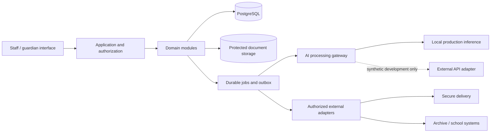

# Implementation plan – Spesped

Version 0.1 · 7 September 2026. Planning only; no application has been built or deployed. All 40 capabilities remain in scope. The legal register distinguishes sourced national requirements from areas needing local/detail review. The DDD model is a first pass to validate with practitioners.

## Delivery strategy

Deliver usable workflows through a modular monolith. Begin with school/access configuration and a complete intake-to-parent-update flow, then add teaching/IEP, assessment/reporting, scheduling, protected cases and integrations. A phase may expose a capability manually before automating it. The [traceability matrix](06-traceability.md) records the first delivery phase; the extensions below remain required for full scope.

Weekly updates initially go only to eligible parents/guardians. A later learner-facing variant is retained in the backlog. Other legally required communications keep their own audience rules from the start.

Every increment has three parallel concerns: user workflow, domain invariants and evidence of correct operation. We measure saved effort after review and correction. A fast generator that creates more review work fails the product goal.

## Proposed architecture

| Layer | Proposed choice | Reason and constraint |
|---|---|---|
| Staff and guardian UI | TypeScript web application with accessible components; framework finalized at P0 | Responsive desktop/tablet use, clear sources and side-by-side review; Norwegian UI |
| Application/API | Python modular backend with FastAPI | Shared ecosystem for document processing, inference and scheduling; domain objects remain independent of framework |
| Core storage | PostgreSQL, separate module ownership, migrations and explicit transaction boundaries | Structured decisions, assignments, revisions and audit relationships |
| Access enforcement | Application policy plus database protections as defense in depth | School isolation and case/learner/purpose restrictions; authentication alone is insufficient |
| Documents | Encrypted object storage with version references and record classes | Originals, approved revisions and exports have different lifecycles |
| Background work | Durable job queue and transactional outbox; implementation selected at P0 | Imports, draft generation and dispatch reconcile safely after retries |
| AI | Server-side capability gateway; remote development adapter and local inference adapter | No provider-specific concepts inside pedagogical domain objects |
| Scheduling | Deterministic constraint checking plus an optimization adapter | The optimizer proposes feasible allocations; educators approve pedagogy |
| Search | Start with structured filters and text search; add local semantic retrieval when justified | Enforce authorization before retrieval and track every indexed derivative |
| Identity/integration | OIDC-compatible identity boundary; evaluate Feide connection with the pilot owner | Teacher roles, school membership and signing authority need explicit mapping |
| Deployment | User-controlled server for production AI; separately protected backups and operational tooling | Capacity, availability, security, support and recovery remain explicit responsibilities |

Primary technical references: [FastAPI](https://fastapi.tiangolo.com/), [PostgreSQL row security](https://www.postgresql.org/docs/current/ddl-rowsecurity.html), [OR-Tools scheduling](https://developers.google.com/optimization/scheduling), [Feide documentation](https://docs.feide.no/). These establish available building blocks, not a claim that the stack itself achieves legal compliance. Verify supported versions and licensing when creating the actual dependency lockfiles.

## P0 – discovery, legal profiles and delivery baseline

Dependencies: none. Work from the current planning artifacts.

- Validate ES01–ES12 with at least a class teacher, special educator, assistant, school leader and relevant privacy/records expertise. Include public and Montessori examples.
- Confirm school legal category, godkjenning, current assessment scheme, municipalities, local templates/deadlines and decision authority.
- Decide the system of record for each data class: enrollment, guardian rights, official grades, decisions, finalized reports, attendance and archives.
- Resolve the minimum deployment facts: host specification, expected learners/concurrent users, IT ownership, backup location and incident contact.
- Record legal/application hotspots and a responsibility matrix. The 90-row registry is input, not an approved executable ruleset.
- Observe current work and measure baseline time for notes, sessions, weekly updates and annual reporting. Use synthetic material in the development environment.
- Select implementation libraries and CI/deployment approach; pin versions only after verifying current support.

Exit: reviewed vocabulary and workflows, initial public/Montessori rule profiles, approved implementation ADRs, synthetic scenarios and a measured workflow baseline. Unresolved local questions remain explicit and cannot be marked compliant.

## P1 – secure foundation and rule/record configuration

Features: F01, F02, F06, F27, F28, F31, F34. Contexts: BC01, BC03, BC14–BC16.

- School configuration, academic periods, typed IDs and school isolation.
- Staff assignments, qualifications, authority grants and guardian relationships with effective dates and restrictions.
- Authentication boundary, role/learner/case authorization, secure sessions and controlled administrative access.
- Initial requirement/rule registry with applicability tri-state, effective dates, accountable roles and configurable deadlines.
- Document classification, basic retention policy, legal holds and auditable access; rights-request intake.
- Secure storage, backups, secret management, minimal operational logs and a tested restore path.
- Accessible UI shell and translation structure for Bokmål/Nynorsk.

Exit: a user cannot retrieve another school's content through direct IDs, search, exports or jobs; expired assignments are refused. A restored environment re-applies current access and erasure/disposition controls. No real pupil data until the P1 privacy and processing gates have been satisfied.

## P2 – first vertical slice: intake → reviewed parent update

Features: F03–F05, F20–F21, F33, F40; extend F27/F28. Contexts: BC02, BC10–BC11, BC15.

- Manual notes, document upload, controlled email-file import and duplicate detection.
- OCR/text extraction, subject association and field confirmation with original source beside the proposal.
- Preserve occurrence date, recorded date, attribution, contradictions and correction history.
- An authorized weekly evidence view with a minimal parent update draft.
- Document revision control, contribution/review, content approval and recipient-specific disclosure authorization.
- Explicit dispatch through a configured secure channel; development uses a sandbox delivery adapter. Delivery state and reconciliation are visible.
- A minimal authenticated guardian reading page when the pilot uses the built-in portal; the complete portal is extended at P7.
- Remote development AI adapter, local adapter contract and deterministic fake model for repeatable workflow verification.
- Workload measurements covering review and editing time.

Exit: demonstrate a complete synthetic update for an eligible guardian. Wrong learner, excessive source material, unverified guardian, changed attachment, revoked access and duplicate submission cases must be refused or handled correctly. The system must show a useful “insufficient evidence” outcome.

Scope note: the first version does not send weekly updates to learners. This is tested per document type, so statutory learner access remains possible.

## P3 – support decision → IEP → teaching → delivery

Features: F07–F10, F12–F13, F15–F16, F39; basic manual schedule ahead of F14 automation. Contexts: BC04–BC08.

- Referral case, participation/consent references, expert-assessment import and formal decision register.
- Typed decision provisions with quantity units, effective period, support category, organization and competence constraints.
- Draft, review and activation of IEP revisions, including goal lineage and learner/parent contributions.
- Curriculum/assessment scheme references and class theme plans; material and reusable teaching-resource library with permitted use.
- Next-session proposals grounded in current plans, available materials and previous delivery.
- Five-minute assistant briefs approved by the responsible teacher; assignment-scoped access.
- Manual weekly scheduling, actual per-learner participation, cancellations and support-coverage ledger.
- One-minute structured notes; dictation is a later F16 extension at P7 after its privacy/quality checks.

Exit: a fictitious learner can move from imported decision to reviewed IEP to planned/delivered session and next-step proposal. A changed decision triggers review without rewriting history. Assistant time cannot silently satisfy a teaching entitlement. An unavailable resource cannot be shown as reserved.

## P4 – assessment, statutory documents and collaborative review

Features: F11, F17–F19, F22, F38; extend F18/F21. Contexts: BC03–BC05, BC09–BC12.

- Assessment instruments, versions, result scales, test conditions and professionally maintained reassessment guidance.
- Progress reviews linked to goal revisions, with insufficient/conflicting evidence displayed.
- Annual ITO evaluation: actual delivery, development against relevant IEP goals, source snapshot and authorized review.
- Ordinary and Montessori half-year assessment, including the correct handling of subjects completed early.
- Contributions from class/subject teachers, meeting preparation and recorded completion of actual assessment conversations.
- Document templates mapped to requirements; separate local half-year report templates from statutory annual ITO evaluation.
- Grade-warning, exemption and appeal workflows with human authority and type-specific timing.
- Secure preparation and export of formal documents; no automated final grades or legal decisions.

Exit: public and Montessori scenarios select the correct document obligations. Missing evidence cannot become a positive progress claim. A document draft cannot close an unperformed conversation or unfulfilled support requirement. Formal approval authority is tested by document type rather than requiring both teacher and special educator for every output.

## P5 – scheduling, staffing and attendance follow-up

Features: F14, F23, F36; extend F15/F22. Contexts: BC07–BC08, BC12.

- Availability, qualifications, guidance/preparation time, breaks, room/material calendars and accepted group relationships.
- Deterministic hard-constraint model and separate ranked preferences.
- Candidate timetable, manual changes, locked allocations and publication with atomic reservation checks.
- Explainable infeasibility report identifying conflicts and capacity gaps; no silent relaxation of statutory/decision constraints.
- Cancellation/replanning workflow, preserving already delivered sessions and staff worktime constraints.
- Attendance import/manual entry, contact follow-up and distinction from cancelled support.

Exit: no overlapping staff/learner/resource commitments; multiple publishers cannot race into a double booking. Group sessions account for each learner's participation and the staff allocation correctly. Teacher-approved grouping remains a prerequisite. A plan that cannot satisfy requirements says so clearly.

## P6 – protected cases and leadership follow-up

Features: F24–F26, F29; extend F06/F22/F27. Contexts: BC03, BC12–BC14.

- School environment casework, investigations, student voice, activity plans, action completion and evaluations.
- Appropriate notification paths, including matters involving a staff member or school leader.
- Dedicated physical-intervention documentation and escalation rules.
- Concern-report and urgent-action workflows that do not impose an unlawful headteacher approval dependency.
- Deviations, remedial tasks, rule-specific evidence and management dashboards that distinguish unresolved, overdue and satisfied states.
- Restricted case access, safe exports and practical unavailable-system procedures.

Exit: protected details do not leak into generic lesson prompts or weekly updates. Emergency/personal reporting is possible without the ordinary report queue. Creating a plan does not mark the underlying issue resolved. Leadership can see responsibility and status without blanket access to every sensitive detail.

## P7 – complete integrations and conditional administration

Features: F30, F32, F35, F37; complete extensions of F16, F21 and F28. Contexts: BC03, BC11, BC14–BC16.

- Prioritize the pilot's actual identity, school administration, calendar, mail, archive and secure delivery systems. Confirm API availability and agreements; do not assume connectors exist.
- Authorized mailbox folders/selections, import reconciliation, deduplication and error recovery. No unrestricted collection from staff mailboxes.
- Full guardian portal, notification preferences, accessible documents and version-specific access history.
- After the guardian-only first release, add the retained learner-facing update variant and participation view where the school enables it. Give it its own age-appropriate content and recipient policy; never expose the internal dossier by reusing the parent page.
- Optional dictation with explicit activation, transcript correction, limited audio retention and local processing.
- School-year transitions, enrollment/authority changes and selective school-transfer packages. Implement current purpose-specific disclosure rules, including applicable 2026 changes, after legal profile review.
- Managed archive transfer, verified receipts, disposition and correction workflows.
- Reconciled GSI/elevdata/statutory extracts and controlled export/attestation; retain official submission in its proper system if no suitable API exists.
- Conditional leader modules from L074–L086: admission, transport, SFO, physical environment, HR/qualification checks, working arrangements, resources, insurance, procurement and private-school governance/finance. Each needs its own confirmed applicable rules before automatic compliance checks.

Exit: external data ownership is documented, round-trip imports reconcile, exports preserve necessary metadata and no external retry creates an unreviewed duplicate. Every conditional area has either implemented agreed workflow/integration or an explicit, accepted external-system boundary; nothing is silently called complete because an API is unavailable.

## P8 – local production AI and operational release

Features: complete F33/F34 plus final integration, accessibility and privacy verification across all features.

This phase completes the production release. The local processing/privacy subset must be pulled forward before **any real-data pilot** using AI, even if the rest of P8 follows later. Real school data must not be sent to the development API just because a pilot precedes general production.

- Benchmark candidate local models against approved synthetic/redacted evaluation scenarios in Norwegian, including source-grounded drafting and refusal to invent evidence.
- Run all required production AI operations on the approved local processing path: extraction/OCR where AI is used, embeddings/retrieval, generation, reranking and speech if enabled.
- Enforce outbound network policy, provider allowlists and local-only production configuration. Disable unapproved telemetry and content logging. No silent external fallback.
- Load/capacity test using measured simultaneous users, document sizes and reporting peaks. Define queueing and manual alternatives when inference is saturated.
- Validate backup restore, key recovery, patching, access reviews, incident contacts and rollback. One server remains a potential availability bottleneck unless redundancy is deliberately added.
- Conduct accessibility assessment, threat-model review, penetration/security assessment appropriate to real-data use, and recovery rehearsal.
- Train staff in review, provenance, exceptions, incident handling and manual alternatives. Confirm school owner acceptance of each enabled rule profile.

Exit: the production system passes the approved acceptance scenarios, legal/privacy/records configuration is signed by responsible owners, local inference quality meets thresholds and total staff workload is improved in the pilot. A limited release may enable only completed workflows; it must label unavailable capabilities honestly.

## Suggested initial backlog slices

| Slice | User-visible result | Essential acceptance condition |
|---|---|---|
| B01 | A teacher sees only assigned learners | Changing a learnerId or queued job context cannot bypass authorization |
| B02 | A parent email is linked to the right learner | Ambiguous names require confirmation; original attribution remains |
| B03 | One note feeds a weekly draft | Every factual sentence has adequate support or an explicit gap |
| B04 | A teacher edits and approves an update | Any edit after approval invalidates the corresponding approval |
| B05 | An eligible guardian receives a frozen package | Recipient rights checked at dispatch; unknown outcomes reconcile |
| B06 | A decision is translated into an IEP proposal | Proposed scope cannot silently exceed or reduce the decision |
| B07 | An assistant gets a brief and records delivery | Brief access is scoped; actual minutes remain separate from plan |
| B08 | An annual evaluation uses the correct year and goals | Historical revisions and delivery gaps remain visible |
| B09 | A scheduler explains an impossible week | No hard constraint is silently converted to a preference |
| B10 | A protected concern gets the correct route | No routine approval queue delays a personal/urgent duty |
| B11 | A source correction reveals affected documents | Draft invalidation and sent-document correction are distinct |
| B12 | The same workflow runs with local inference | Production cannot contact a remote development model |

## Verification plan

Tests should cover meaningful invariants and failure modes, not merely mirror field setters.

1. Domain examples: correct rule profile, decision scope, revision approval, recipient authority, delivery counting, deadline semantics and lawful disposition.
2. Authorization tests: cross-school, cross-learner and restricted-case access through APIs, source links, exports, semantic search and background jobs. Database service accounts must not silently bypass the intended row policies.
3. Workflow tests: ES01–ES12 happy paths and exceptions, including source conflict, withdrawn access, changed attachments, overlapping schedule publication and queue retry.
4. AI evaluation: Norwegian quality, valid source support, unsupported-claim rate, wrong-learner leakage, prompt injection in uploaded documents, excessive disclosure and contradictory evidence. Evaluate the full pipeline and each changed model/prompt/template version.
5. Legal profile fixtures: public grade 8; Montessori grade 8; Montessori subject completed early; ITO annual review; learner with assistance only; under-15 and over-15 authority scenarios without treating age as a universal privacy rule.
6. Human usability: observed time for input, review, editing and retrieval; assistant comprehension; keyboard/screen-reader completion; user ability to reject a poor suggestion.
7. Operations: recovery to agreed objectives, source erasure propagated to indexes, retained records preserved lawfully, provider failure, unknown delivery outcome and local inference outage.

Initial release targets are proposals to validate: zero cross-learner/cross-school disclosure in the adversarial test suite; all evaluated factual report statements traceable to supporting material; all invalid approval/recipient scenarios blocked; median routine note entry ≤ 60 seconds and normal assistant-brief orientation ≤ 5 minutes. No finite test suite proves universal absence of AI error or complete legal compliance.

## Operating the rule and template catalog

Maintain an owner, source, effective date, status and review history for every requirement version. Keep national law, regulation, authority approval, guidance, local routine and product preference distinguishable. A reviewed rule change runs an impact calculation against enabled schools and open obligations. Notify the relevant staff about changed work, not every source-page edit.

Maintain templates the same way: purpose, applicability, required content, author/reviewer roles, recipient rules, record category and version. Default dates must never invent a national deadline. A newly discovered rule can create a review task and a manual workaround while implementation is pending.

## Product boundaries and remaining decisions

This program supports teaching, documentation and coordination. Actual teaching, meetings, professional judgement, PPT assessments, statutory authority, physical environment work and health treatment remain with responsible people/services. Existing systems may remain authoritative for grades, HR, payroll, finance, formal archives and public submissions. Their integration/export boundaries count as deliberate product scope only when the user workflow and ownership are explicit.

The full scope is too broad for a credible calendar estimate before P0. Estimate each accepted slice after identifying team capacity, integration access, local obligations and server constraints. The production plan must include ongoing legal/template maintenance and operational responsibility as actual work, not assume that deployment completes them forever.

## Planning completion criteria

The present planning deliverable is complete when all user capabilities have IDs, every mapped legal area has a source and capability link, event flows cover the work and its exceptions, proposed aggregates have consistency rules, and implementation phases include the full backlog. Legal sign-off for a particular school, practitioner validation and implementation itself are subsequent work with explicit prerequisites above.
